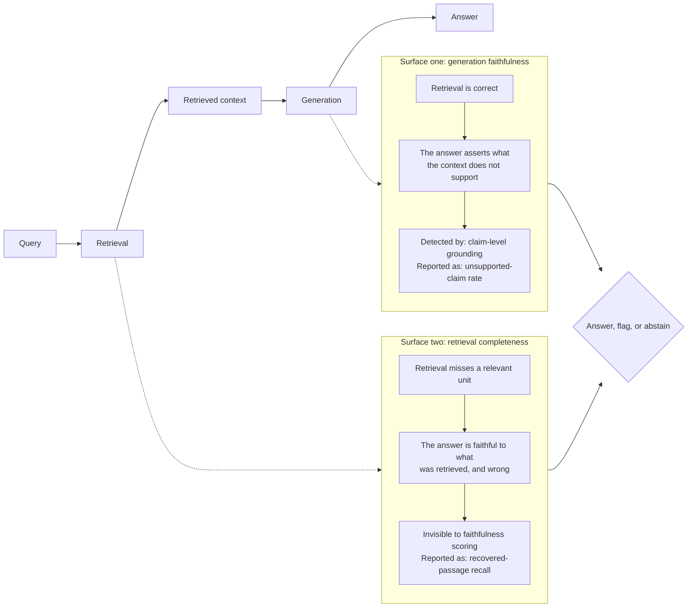
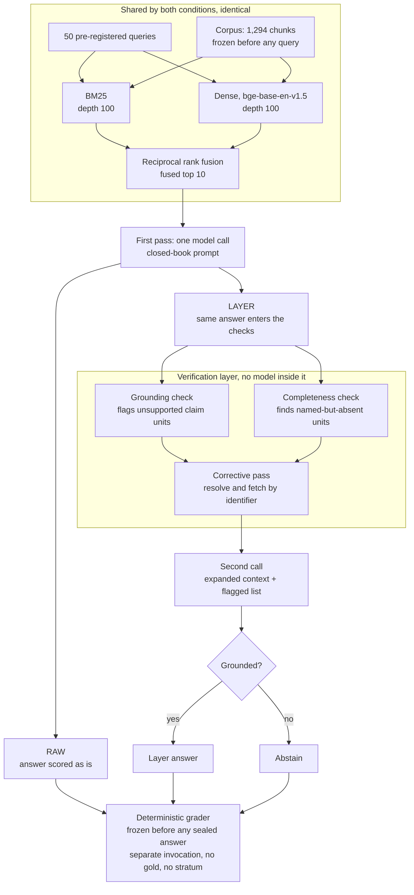
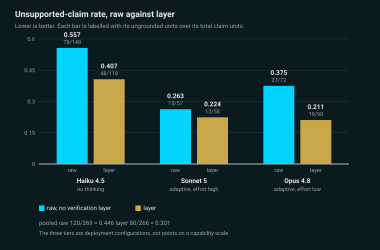
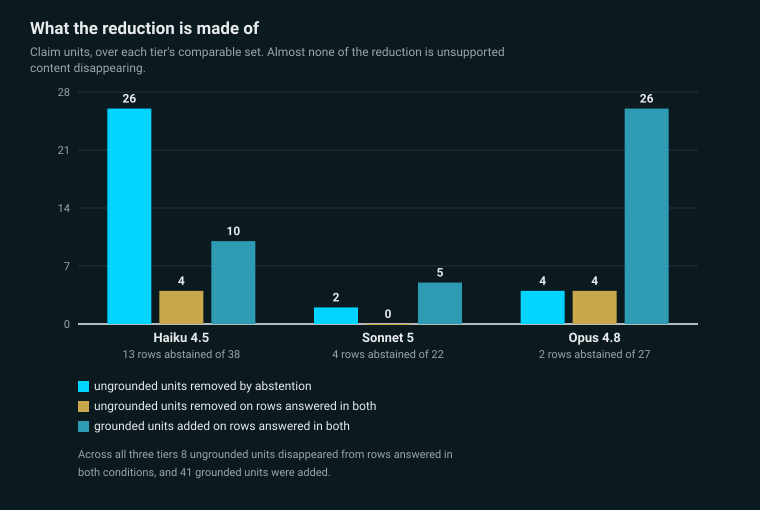
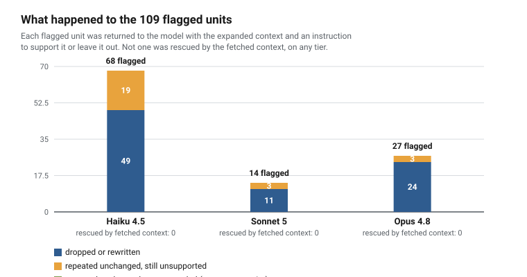

# architect-rag-verification

A deterministic verification layer over a retrieval-augmented generation pipeline, evaluated on a
pre-registered query set against a bounded public corpus of AI governance frameworks.

Every number in this README reproduces from committed files with no API key and no cost. The
generation step ran once; its outputs are committed. See [docs/REPRODUCE.md](docs/REPRODUCE.md).

**The headline is not that the layer works. It is that the layer's measured effect on this corpus
is mostly abstention and denominator change, and almost none of it is unsupported content
disappearing.** That is reported below in the same voice as everything else.

## The problem

Retrieval-augmented generation fails on two distinct surfaces, and most evaluations blur them.

**Surface one, generation faithfulness.** The model asserts claims the retrieved chunks do not
support. Even with perfect retrieval this happens, and it is what faithfulness scoring is designed
to catch.

**Surface two, retrieval completeness.** The retriever misses a relevant passage, the model answers
faithfully from the partial context, and the answer is faithful and wrong. This is the trap where
faithfulness scores look high while the system misses the passage that mattered.

They combine into one decision: answer when retrieval is strong and every claim is grounded, flag
or abstain when either fails. This repository keeps them separate throughout and reports them under
different metric names, because a single number over both hides exactly the failure that matters.

## The design

Three conditions over one pre-registered query set of 50 queries, on three model tiers.

**Raw** is standard RAG: the fused top 10 chunks, a neutral production prompt that includes the
ordinary instruction to say it does not know, a single pass, and the answer scored as is. **Raw
means no verification layer, not no retrieval.** The baseline receives exactly the same retrieved
context the layer condition does.

**Layer** is the same model on the same first pass, followed by deterministic post-hoc checks.
Nothing in the layer is a model. It resolves the references printed in the query and in the
retrieved chunks, fetches by identifier any named unit the first pass did not return, flags the
claims the context does not support, and issues one second call on the expanded context. It
abstains if it still cannot ground.

**No-context** is the same model with no retrieved context at all, one pass. It measures how much of
the raw score is carried by parametric knowledge of a public corpus rather than by retrieval. It is
a contamination probe, not a third arm of the comparison, and it reports its own two figures under
their own names.

Raw and layer share the corpus, the chunking, the first-pass retrieval, the query set, the decoding
parameters, the grader, and **the identical first-pass generation**. The layer is post-hoc on the
same first pass, which removes generation variance from the delta rather than saving a run.

### Closed-book enforcement

Both frameworks are public and pre-date every tier's training cutoff, so the corpus cannot be
firewalled from the models. The raw and second-call prompts therefore carry an explicit instruction
to answer only from the provided context and never from training memory, and a test asserts that
the no-context prompt is the only one that omits it.

**A terminology note, because this repository inverts a common usage.** "Closed-book" is used here
for that grounding discipline, answering only from retrieved context. In the wider literature
closed-book usually means the opposite, answering with no retrieval at all. The no-retrieval
condition here is called no-context for exactly that reason, and the naming decision is recorded in
`PREREGISTRATION.md` where it was made.

### Three deployment configurations, not a capability ladder

The three tiers do not reason the same way, and the differences are not ordered the way the tiers
are.

| tier | model string | reasoning regime |
| --- | --- | --- |
| Haiku 4.5 | `claude-haiku-4-5-20251001` | no thinking; the tier is extended-thinking-only and rejects adaptive thinking |
| Sonnet 5 | `claude-sonnet-5` | adaptive thinking at the API default effort, high |
| Opus 4.8 | `claude-opus-4-8` | adaptive thinking at effort low, fixed by the pre-registration |

The middle tier reasons the most. Forcing uniformity by disabling thinking on Sonnet was rejected on
a specific ground: weaker raw answers on that tier would enlarge the layer's measured delta there,
which improves a number without improving the system. So these are three deployment configurations,
and every cross-tier sentence in this README carries the reasoning regime beside the tier name.
Comparing them as points on a capability scale would be wrong.

Decoding differs by tier because it had to. Temperature 0 was pre-registered; two of the three tiers
reject it. This was settled by measurement rather than by reading the documentation, with six probe
records committed, three probes and three matched controls: Haiku accepted temperature 0 and it was
sent on every Haiku run; Sonnet 5 and Opus 4.8 both returned HTTP 400 and the parameter was omitted
on those tiers. Each tier carries one setting on both sides of its own raw-versus-layer comparison,
so every delta is taken under identical decoding.

Note for anyone regenerating: `claude-haiku-4-5-20251001` is the only dated snapshot of the three,
and Anthropic's model deprecations page lists it as Active with a tentative retirement date of not
sooner than October 15, 2026. The other two are undated aliases and float.

## Results

Full tables are in [docs/RESULTS.md](docs/RESULTS.md). The headline is here.

**Every rate ships with the number of ungrounded claim units, the total claim units, and the number
of answered rows.** A rate can fall by denominator growth alone with the ungrounded count unchanged.
That is not hypothetical: it happened on the Opus development run, and it is why this repository
does not quote a first-pass-versus-second-call rate without both unit counts.

### Unsupported-claim rate, raw

Over all 50 rows per tier.

| tier and regime | ungrounded / claim units | rate | answered rows | abstained |
| --- | --- | --- | --- | --- |
| Haiku 4.5, no thinking | 78 / 140 | 0.5571 | 40 | 10 |
| Sonnet 5, adaptive at effort high | 15 / 57 | 0.2632 | 23 | 27 |
| Opus 4.8, adaptive at effort low | 27 / 72 | 0.3750 | 28 | 22 |
| **pooled** | **120 / 269** | **0.4461** | **91** | **59** |

These are rates under a lexical ruler with no stemming and no entailment judge, so a true claim
restating a present chunk in the model's own words scores as unsupported. **0.4461 is not a claim
that 45 percent of what the models said was false.** See Honest boundary.

### Unsupported-claim rate, layer

Same rows, same grader. The second answer on the 48 rows the corrective pass fires on, and the first
answer on the two rows where it does not fire and the layer therefore acted neither by a second call
nor by abstaining.

| tier and regime | ungrounded / claim units | rate | answered rows | abstained |
| --- | --- | --- | --- | --- |
| Haiku 4.5, no thinking | 48 / 118 | 0.4068 | 27 | 23 |
| Sonnet 5, adaptive at effort high | 13 / 58 | 0.2241 | 19 | 31 |
| Opus 4.8, adaptive at effort low | 19 / 90 | 0.2111 | 26 | 24 |
| **pooled** | **80 / 266** | **0.3008** | **72** | **78** |

The two pooled rates are over different row sets, which is why the answered-row counts stand beside
them here and in every table this repository publishes.

*Derived from `eval/test_grading_results.json` by `python -m src.figures.build_figures`.*

### What the reduction is made of, and this is the finding

Restricting to the rows the layer actually acted on, and splitting them into rows it abstains on and
rows answered in both conditions:

| | Haiku | Sonnet | Opus |
| --- | --- | --- | --- |
| rows removed by abstention | 13 | 4 | 2 |
| units they carried, ungrounded / total | 26 / 28 | 2 / 4 | 4 / 4 |
| on rows answered in both, ungrounded units removed | 4 | 0 | 4 |
| on rows answered in both, grounded units added | 10 | 5 | 26 |
| on rows answered in both, total units added | 6 | 5 | 22 |

Across all three tiers, **eight ungrounded units disappeared** from rows answered in both
conditions, and **41 grounded units were added** to them. Abstention removed rows whose raw rate was
far above the tier average: 26 of 28 units on the Haiku rows it removed.

**The layer's measured effect on this corpus is mostly a denominator effect and an abstention
effect. The part that is unsupported content actually disappearing is small.**

*Derived from the per-row blocks of `eval/test_grading_results.json` by
`python -m src.figures.build_figures`.*

### The mechanism, from the other side: zero of 109

The layer flagged 109 claim units across the three tiers as unsupported and handed each back to the
model with an instruction to support it from the expanded context or leave it out.

| tier | flagged | came back unchanged | of those, now grounded | dropped or rewritten |
| --- | --- | --- | --- | --- |
| Haiku 4.5, no thinking | 68 | 19 | **0** | 49 |
| Sonnet 5, adaptive at effort high | 14 | 3 | **0** | 11 |
| Opus 4.8, adaptive at effort low | 27 | 3 | **0** | 24 |
| **total** | **109** | **25** | **0** | **84** |

**Not one flagged unit anywhere was rescued by the fetched context, on any tier.** This reproduces
the development-run result exactly. The completeness pass fetched the right blocks; the flagged
units were paraphrase of blocks already present, so there was nothing for a fetch to repair. The
layer's faithfulness effect comes from its detector plus its instruction, the model dropping or
rewriting what was flagged, and not from retrieval completeness.

*Derived from `eval/test_grading_results.json` by `python -m src.figures.build_figures`.*

### Retrieval, under two different names

The two conditions never share a metric label. The first pass reports rank-based metrics against the
fused top 10. The layer reports recovered-passage recall over its final context set, with that set's
size beside it, and no rank-based figure at all, because under augmentation the context set is not
ten chunks and a precision over that denominator would fall for arithmetic reasons and read as a
regression.

Macro-averaged over the 42 gold-bearing rows. The eight adversarial rows have empty gold and carry
no retrieval figure by the pre-registration's own exclusion.

| stratum | n | Recall@10, first pass | recovered-passage recall, layer |
| --- | --- | --- | --- |
| single_hop, three sources | 18 | 1.0000 | 1.0000 |
| multi_hop / eu_internal_xref | 12 | 0.7917 | 0.8750 |
| multi_hop / action_subcategory | 4 | 0.0000 | 0.2500 |
| near_miss, two sources | 8 | 0.1250 | 1.0000 |
| **overall** | **42** | **0.6786** | **0.8929** |

First-pass rank metrics: P@10 0.1214 on carrier counts 1 to 3, MRR 0.5518, NDCG@10 0.5580.
Precision is bounded above by the available gold chunk count over ten, a property of precision at a
fixed k rather than of the retriever, so recall, MRR and NDCG carry the result. Every precision
figure ships with its carrier count, and the code returns them together.

### The near-miss reduction is grader conformance, not the layer working

This reading was committed in advance, before the number existed: a near-miss reduction counts as
the layer working only if it concentrates on the units carrying the queried reference surface, and a
reduction that does not is grader conformance, the model rewriting toward source wording.

The measurement is unambiguous. On every tier and in both conditions, every unit carrying a
reference surface is ungrounded and every unit carrying none is grounded. Haiku's rate fell from 5
of 6 to 4 of 9 while its surface-carrying units went from 5 of 5 ungrounded to 4 of 4 ungrounded, a
rate of 1.0 on both sides, and four grounded units carrying no surface were added underneath. Sonnet
and Opus did not move at all, 1 of 6 in both conditions.

**The reduction sits entirely on the units the reference condition is silent about, so it is
reported as grader conformance and not as the layer working.**

### The no-context condition, under its own two names

This condition reports a no-context abstention rate and a parametric coincidence rate. Neither is
placed beside an unsupported-claim rate. They count opposite things over answers produced under a
prompt carrying no closed-book instruction, so a table putting them in one column would be wrong
however the columns were labelled.

| tier and regime | no-context abstention rate | parametric coincidence rate |
| --- | --- | --- |
| Haiku 4.5, no thinking | 0.6000 | 0.0000, 0 of 124 units |
| Sonnet 5, adaptive at effort high | 0.7600 | 0.1000, 3 of 30 units |
| Opus 4.8, adaptive at effort low | 0.6400 | 0.1111, 3 of 27 units |

Haiku's zero is a measurement and not an empty result: the same predicate in the same run returns
grounded units on the other two tiers, so it is shown capable of a non-zero on this condition.
Parametric knowledge of these frameworks reproduces almost none of the retrieved wording under a
lexical ruler, which bounds how much of the raw score retrieval is not carrying.

### The layer's added cost and latency

The corrective pass issues no model call of its own. It resolves references and fetches by
identifier: **930 chunks over the 48 firing rows on every tier**, with final context sets running 12
to 57 and a mean of 29.4.

The added generation cost is the second call alone, because the first pass is shared with the raw
condition by construction: 0.207560, 0.579010 and 1.479963 dollars, **2.266533 in total**, at batch
latencies of 88, 73 and 66 seconds. All nine runs together cost **3.218898**.

### A secondary comparison, reported whichever way it falls

Haiku 4.5 with no thinking, plus the layer, reaches 48 of 118 units, 0.4068, over 27 answered rows.
Opus 4.8 with adaptive thinking at effort low, raw, reaches 27 of 72, 0.3750, over 28 answered rows.

**The cheap tier with the layer does not reach the expensive tier without it.** The two sides share
no model, no reasoning regime and no decoding setting, and they are rates over different row sets,
which is why both answered-row counts sit beside them. No figure was predicted for this pair. It is
reported because it was measured, including this way, which is the outcome least useful to the case
study.

### Pre-registered predictions

Twenty-six predictions were committed before any sealed answer existed and are scored mechanically
from the graded blocks inside the results artifact. **Ten held. Fifteen are contradicted. One
attached no prediction to the pair it names.** Every contradicted line stands as written; the
predictions file is not edited, because a contradicted prediction that gets edited is not a
prediction.

## Reproducibility

**Generation is the only paid step and it ran once.** Its outputs are committed: the queries, the
retrieved chunks, the raw answers, the layer's second-call answers and the no-context answers. Every
number above then re-derives deterministically over those committed files with no API key, no
network and no cost.

| artifact | sha256 | bytes |
| --- | --- | --- |
| `eval/test_retrieval_results.json` | `daf58a42a9d77acf91ef0cb168f940f774bc395a08da17dafff27eb91bd763d2` | 71,723 |
| `eval/test_layer_results.json` | `7497e19c9a2a18b8ca5080f20c8b6df9d4bd791c3c0e375a4fa153531e4baffb` | 104,326 |
| `eval/test_grading_results.json` | `188dacfb105d5f08ad606bcef2af8e31d836e8000877ca364a3eba8a27ede494` | 836,853 |

These three digests are asserted by committed tests on every suite run, so a rebuild that disagrees
with the published bytes fails the suite rather than passing quietly.

The suite is 991 tests. A fresh clone reports **984 passed and 7 skipped**, the seven at four sites
that each name the deliberately uncommitted segment embedding cache. With that cache built and the
pinned model present it is 991 passed and 0 skipped. Read the skips by name rather than by count.

[docs/REPRODUCE.md](docs/REPRODUCE.md) has the full walkthrough, including how to re-derive an
artifact yourself without touching the committed one, and the limits on regenerating answers with
your own key.

## How the ground truth was built

Gold passages are defined by the documents' own cross-reference structure wherever possible, so
ground truth is a property of the corpus rather than a choice that flatters the layer. Gold is
unit-level and slot-based: a slot is satisfied by any unit carrying its statement, and slots within a
query are disjoint. Adversarial queries have an empty gold set and the only correct behaviour is
abstention.

The commit ordering is the evidence, not a claim in prose. The specification committed first with no
query, gold, rank, score or result present. The queries, their gold sets, their per-edge verification
records and their embeddings committed second. Retrieval ran third. Generation ran last, behind a
spend gate. Two provenance tests were gated shut until the results existed and open automatically at
the commit that adds them, so the ordering is enforced by the filesystem rather than by a flag.

The corpus is 1,150 units in 1,294 chunks across the EU AI Act, NIST AI 100-1, NIST AI 600-1 and the
NIST AI RMF Playbook, all frozen before any query existed. ISO/IEC 42001 is referenced by three
adversarial queries and is never included in any form, because it is copyrighted.

## Honest boundary

**The completeness check works because the corpus is bounded and every printed reference in it can
be resolved per query. This does not scale.**

The layer resolves references and fetches by identifier against a committed index of 1,150 units.
That index fits in memory and the resolution is a string operation. As an engineering judgment
rather than a measurement, the approach stays practical while the unit index fits in memory and the
reference grammar stays closed, which is roughly a corpus in the low tens of thousands of units with
a stable citation convention. Past that, the honest fallback is retrieval-confidence estimation with
abstention rather than reference-complete checking. This repository does not claim the
bounded-corpus method as a general solution.

**The grader is lexical.** The unsupported-claim rate is normalised-token overlap in a sliding
window, with no stemming and no entailment judge. A true claim restating a present chunk in the
model's own words scores as unsupported. **Every rate in this repository is a property of that ruler
before it is a property of a model.** This is a real limit on what the headline means, not a
disclaimer: the pooled 0.4461 raw rate says the ruler could not align 45 percent of the claim units
against the context it was given, which is a different statement from 45 percent of them being
false.

**The corpus is in the training data.** Both frameworks are public and pre-date every tier's cutoff.
Parametric knowledge is present identically on both sides of the raw-versus-layer comparison so it
cancels in the delta, but it inflates the absolute numbers, which compresses the delta rather than
inflating it. The no-context condition measures that directly and turns the caveat into a number.

## What still fails

Nine entries, in [docs/RESULTS.md](docs/RESULTS.md). They include: the retriever cannot discriminate
between byte-identical duplicates at all; neither structural retrieval failure was engineered out,
deliberately; action-to-parent recovers one of four and the mechanism is named; a published number
this repository could not reproduce, and the retraction; a wrong claim that reached three artifacts
and could only be corrected in two; nineteen of thirty-one examined EU cross-references are not
content dependencies; the self-containedness instrument reaches the EU AI Act and not NIST, and the
blind spot is on the arm a reviewer can re-derive for free; answers duplicated inside a single unit,
which only one instrument reaches; and what the instrument cannot see at all.

## What this study does not measure

Five exclusions, in [docs/RESULTS.md](docs/RESULTS.md). Briefly: no citations are requested, so the
citation-faithfulness failure mode this repository's own methodology names has no surface here and
no figure scores it; misattribution is caught only where the committed grammar reaches; the
existence-denial grammar has a zero development sample and was never exercised on real data; the
abstention threshold rests on a single development case; and the multi-chunk asymmetry is measured
but not broken out per stratum.

## How this repository was developed

Development used Claude Code under a governance file, `CLAUDE.md`, read at the start of every
session, and a running `SESSION_LOG.md` recording the decisions behind each unit of work rather than
the sequence of events. Both ship. A working file holding session state and notes is not tracked
here; it is named in the session log wherever an entry records work done on it, and nothing in it is
needed to reproduce any number in this repository.

Commits carry a `Claude-Session:` provenance trailer, appended by the harness when the session that
produced them was configured to append it. **The trail is not uniform, and a reader running
`git log` will find that directly**, so the shape is stated here rather than left to be
reconstructed: the trailer is present across some runs of commits and absent across others,
throughout the history and not only at its start, because that harness configuration changed over
time rather than because authorship did. One commit deliberately carries none, its message having
been authored outside a Claude Code session, so the absence there is accurate provenance rather
than a gap. The trailer is a provenance reference and not an authorship claim, and no number in
this repository depends on it.

Two conventions a reviewer will otherwise trip over. `SESSION_LOG.md` carries one entry per unit of
work, naming every commit it covers, and an entry does not name the commit that places it, because
that commit's content is the entry; every commit in the history touching any file other than
`SESSION_LOG.md` is named by some entry. And phase citations in `PREREGISTRATION.md` name the
session-log commit that closes that phase, so `git show 71ef631` shows a log entry rather than the
corpus freeze it cites.

Repository history was rebuilt twice, both times on a local repository with no remote configured
that had never been pushed, and each under an explicitly authorized one-time exception to this
repository's own rule against rewriting committed history. Both exceptions are spent; a defect in
history is now fixed forward or lived with.

The first, at the start of the project, rebuilt the two bootstrap commits to remove a co-author
trailer. The second, before first publication, removed private working files. In that second
operation commit hashes changed and three commits that became empty were pruned, taking the history
from 51 commits to 48; author and committer identities, timestamps and commit ordering were
unchanged for every surviving commit, and the tree at the tip was byte-identical to the tree before
the rebuild, so no file content moved. Citations to the old hashes were re-anchored mechanically
from the rebuild's commit map, and four that named pruned commits were removed rather than remapped.

The ordering claim this repository rests on, that the pre-registration and the query set predate
every result, is untouched by either operation: what changed was hash identity, and timestamps and
ordering did not move. Both operations are disclosed here and recorded in the session log rather
than left to be discovered.

## License

The code in this repository is licensed under the Apache License 2.0, see [LICENSE](LICENSE).
Corpus documents keep their own licenses and reuse terms, recorded per document in
[corpus/SOURCES.md](corpus/SOURCES.md). Vendored third-party files keep theirs, recorded in the same
file.
