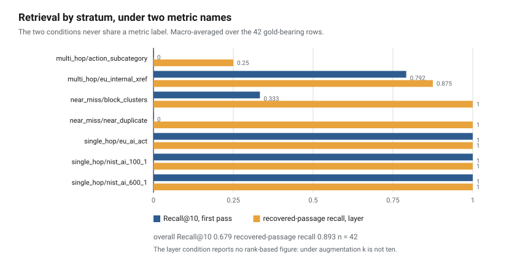
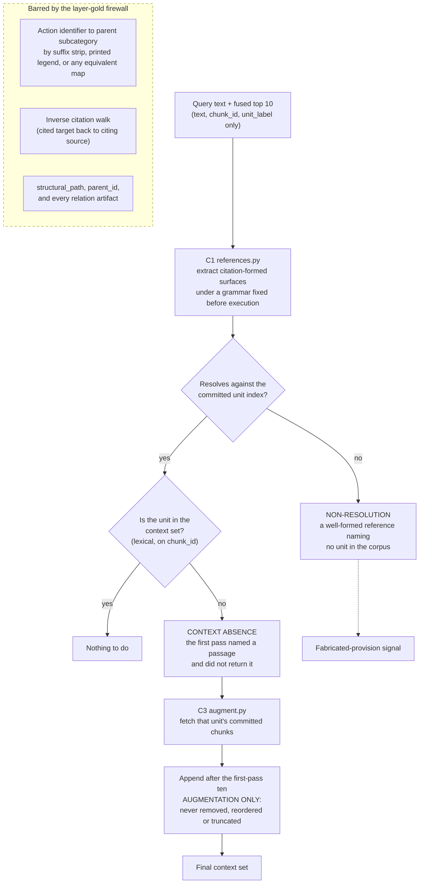
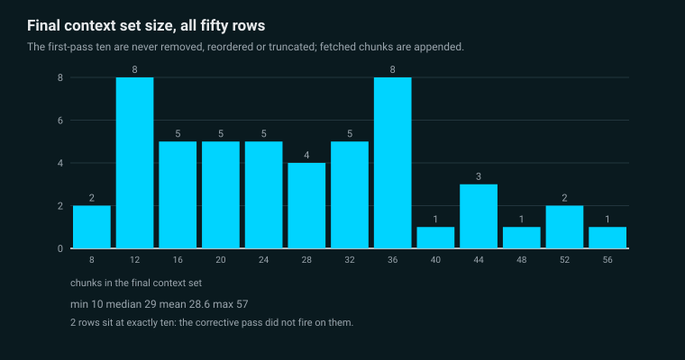
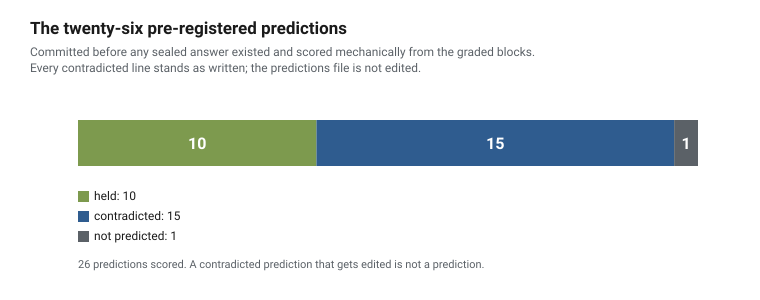

# Results

Every figure here is read from `eval/test_grading_results.json`, `eval/test_retrieval_results.json`
or `eval/test_layer_results.json`, all three pinned by digest and asserted on every suite run. See
[REPRODUCE.md](REPRODUCE.md).

Machine-readable CSV forms of the tables below are in [`results/tables/`](../results/tables), one
observation per row, written from the same three artifacts by
`python -m src.figures.build_tables` and pinned by digest like everything else here.

---

## How rates are reported here

Every rate ships with the number of ungrounded claim units, the total claim units, and the number of
answered rows it was computed over. This is not conservatism, it is a finding of the development
run.

On the Opus development tier the unsupported-claim rate fell from 8 of 29 to 8 of 31 across the
layer's second call: **the rate dropped and the ungrounded count did not move at all.** A
verification layer that adds grounded claims to an answer lowers its unsupported-claim rate by
growing the denominator, which is a real effect and is not the same effect as removing an
unsupported claim. Any comparison reporting only the rate cannot distinguish the two, so no
comparison in this repository reports only the rate.

Two further conventions, both visible in the tables below.

**A stratum with zero answered rows reports `undefined`, never zero.** A tier that abstained on
every row of a stratum has no rate; printing 0.0000 there would read as perfect performance on
exactly the rows the model refused to answer.

**All five committed strata are listed with explicit values**, including the ones that are zero or
undefined. A table that silently omits a stratum is a table a reader cannot check against the
pre-registration's own composition.

---

## 1. Unsupported-claim rate, by condition and tier

Over all 50 rows per tier.

### Raw

| tier and regime | ungrounded / claim units | rate | answered | abstained |
| --- | --- | --- | --- | --- |
| Haiku 4.5, no thinking | 78 / 140 | 0.5571 | 40 | 10 |
| Sonnet 5, adaptive at effort high | 15 / 57 | 0.2632 | 23 | 27 |
| Opus 4.8, adaptive at effort low | 27 / 72 | 0.3750 | 28 | 22 |
| **pooled** | **120 / 269** | **0.4461** | **91** | **59** |

### Layer

| tier and regime | ungrounded / claim units | rate | answered | abstained |
| --- | --- | --- | --- | --- |
| Haiku 4.5, no thinking | 48 / 118 | 0.4068 | 27 | 23 |
| Sonnet 5, adaptive at effort high | 13 / 58 | 0.2241 | 19 | 31 |
| Opus 4.8, adaptive at effort low | 19 / 90 | 0.2111 | 26 | 24 |
| **pooled** | **80 / 266** | **0.3008** | **72** | **78** |

Over the 42 gold-bearing rows the pooled raw rate is 0.4419, 118 of 267, and the layer rate is
0.3008, 80 of 266. The layer figure is identical to its all-fifty figure because every adversarial
row abstains under the layer on every tier.

The pooled rate is computed from the pooled counts. It is **not** the mean of the three tier rates:
a micro-average is not additive, and the artifact states that in its own text beside each block.

---

## 2. Unsupported-claim rate, by stratum

All five committed strata, explicit values, `undefined` where a tier answered no row.

### Raw

| stratum | Haiku 4.5 | Sonnet 5 | Opus 4.8 |
| --- | --- | --- | --- |
| single_hop | 33 / 88, 0.3750, 18 answered | 9 / 41, 0.2195, 18 answered | 10 / 42, 0.2381, 18 answered |
| clean_multi_hop | 29 / 34, 0.8529, 12 answered | 5 / 10, 0.5000, 4 answered | 14 / 18, 0.7778, 8 answered |
| action_to_parent | 9 / 10, 0.9000, 4 answered | 0 / 0, **undefined**, 0 answered | 2 / 6, 0.3333, 1 answered |
| near_miss | 5 / 6, 0.8333, 4 answered | 1 / 6, 0.1667, 1 answered | 1 / 6, 0.1667, 1 answered |
| adversarial | 2 / 2, 1.0000, 2 answered | 0 / 0, **undefined**, 0 answered | 0 / 0, **undefined**, 0 answered |

### Layer

| stratum | Haiku 4.5 | Sonnet 5 | Opus 4.8 |
| --- | --- | --- | --- |
| single_hop | 28 / 86, 0.3256, 17 answered | 6 / 40, 0.1500, 14 answered | 11 / 58, 0.1897, 18 answered |
| clean_multi_hop | 10 / 16, 0.6250, 4 answered | 6 / 12, 0.5000, 4 answered | 5 / 20, 0.2500, 6 answered |
| action_to_parent | 6 / 7, 0.8571, 2 answered | 0 / 0, **undefined**, 0 answered | 2 / 6, 0.3333, 1 answered |
| near_miss | 4 / 9, 0.4444, 4 answered | 1 / 6, 0.1667, 1 answered | 1 / 6, 0.1667, 1 answered |
| adversarial | 0 / 0, **undefined**, 0 answered | 0 / 0, **undefined**, 0 answered | 0 / 0, **undefined**, 0 answered |

Two things worth reading off this rather than leaving buried.

**The adversarial row is the sharpest single result in the table.** Raw, Haiku answered two
adversarial queries and every claim unit in both was ungrounded, a rate of 1.0000. Under the layer,
all three tiers abstain on all eight adversarial rows. Sonnet and Opus already abstained on all
eight raw.

**Opus single_hop grows from 42 claim units to 58 under the layer**, and its rate falls from 0.2381
to 0.1897 while the ungrounded count rises from 10 to 11. That is the denominator effect the
reporting rule exists to expose, visible in one row.

*Derived from `eval/test_grading_results.json` by `python -m src.figures.build_figures`. Every bar
carries its ungrounded units over its total claim units and the number of answered rows it was
computed over, the same reporting rule the tables above follow. A stratum a tier answered no row of
carries no rate and is marked as abstained on all of them, never drawn as a bar of height zero.
Several per-stratum denominators here are small, and the readings this section states in prose are
the readings; the figure adds none.*

---

## 3. The comparable set

The rate over the whole answered set mixes rows the layer never touched with rows it rewrote. The
narrower comparison is the rows carrying a second call that were answered at the first pass,
membership defined by the first pass alone so both sides run over the same population.

| tier and regime | rows | raw | layer | layer abstained within the set |
| --- | --- | --- | --- | --- |
| Haiku 4.5, no thinking | 38 | 68 / 128, 0.5313 | 38 / 106, 0.3585 | 13 |
| Sonnet 5, adaptive at effort high | 22 | 14 / 54, 0.2593 | 12 / 55, 0.2182 | 4 |
| Opus 4.8, adaptive at effort low | 27 | 27 / 69, 0.3913 | 19 / 87, 0.2184 | 2 |

Note the Sonnet and Opus claim-unit counts on the layer side: 54 to 55, and 69 to 87. Both rose.

---

## 4. What the reduction is made of

Splitting the comparable set into rows the layer abstains on and rows answered in both conditions:

| | Haiku | Sonnet | Opus |
| --- | --- | --- | --- |
| rows removed by abstention | 13 | 4 | 2 |
| units they carried, ungrounded / total | 26 / 28 | 2 / 4 | 4 / 4 |
| on rows answered in both, ungrounded units removed | 4 | 0 | 4 |
| on rows answered in both, grounded units added | 10 | 5 | 26 |
| on rows answered in both, total units added | 6 | 5 | 22 |

Across all three tiers, **eight ungrounded units disappeared** from rows answered in both
conditions, and **41 grounded units were added** to them. Abstention removed rows whose raw rate was
far above the tier average: 26 of 28 units on the Haiku rows it removed.

**The layer's measured effect on this corpus is mostly a denominator effect and an abstention
effect, and the part of it that is unsupported content actually disappearing is small.**

---

## 5. The flagged-unit fate table

| tier | flagged | repeated unchanged | of those, now grounded | dropped or rewritten | rows repeating at least one |
| --- | --- | --- | --- | --- | --- |
| Haiku 4.5, no thinking | 68 | 19 | **0** | 49 | 12 |
| Sonnet 5, adaptive at effort high | 14 | 3 | **0** | 11 | 3 |
| Opus 4.8, adaptive at effort low | 27 | 3 | **0** | 24 | 3 |
| **total** | **109** | **25** | **0** | **84** | |

Both arithmetic identities are asserted in the artifact on all three tiers: flagged equals repeated
plus dropped, and repeated equals now-grounded plus still-unsupported.

**Zero of 109 flagged units were rescued by the fetched context, on any tier.** The completeness
pass fetched the right blocks; the flagged units were paraphrase of blocks already present.

The population is the 48 rows the corrective pass fires on. Two rows are excluded on every tier
because it does not fire on them, so no second-call body and no flagged list exists for them.

---

## 6. Retrieval, under two names

The two conditions never share a metric label. Macro-averaged over the 42 gold-bearing rows; the
eight adversarial rows carry no retrieval figure by the pre-registration's own exclusion and are
marked rather than dropped.

| stratum | n | P@10 | carriers | R@10 | MRR | NDCG@10 | recovered-passage recall, layer | context size mean |
| --- | --- | --- | --- | --- | --- | --- | --- | --- |
| single_hop / eu_ai_act | 11 | 0.1182 | 1 to 2, median 1 | 1.0000 | 0.8939 | 0.9210 | 1.0000 | 29.7 |
| single_hop / nist_ai_100_1 | 5 | 0.2200 | 1 to 3, median 3 | 1.0000 | 0.8000 | 0.8524 | 1.0000 | 16.6 |
| single_hop / nist_ai_600_1 | 2 | 0.1000 | 1 | 1.0000 | 0.7500 | 0.8155 | 1.0000 | 14.0 |
| multi_hop / eu_internal_xref | 12 | 0.2000 | 2 | 0.7917 | 0.6417 | 0.5898 | 0.8750 | 31.7 |
| multi_hop / action_subcategory | 4 | 0.0000 | 3 | 0.0000 | 0.0000 | 0.0000 | 0.2500 | 17.8 |
| near_miss / block_clusters | 3 | 0.0333 | 1 | 0.3333 | 0.0476 | 0.1111 | 1.0000 | 33.3 |
| near_miss / near_duplicate | 5 | 0.0000 | 1 | 0.0000 | 0.0000 | 0.0000 | 1.0000 | 37.6 |
| adversarial, three subtypes | 8 | not computed, gold is empty | 0 | | | | | 31.6 |
| **overall** | **42** | **0.1214** | 1 to 3, median 2 | **0.6786** | **0.5518** | **0.5580** | **0.8929** | **28.6** |

Carrier counts over the fifty: 8 rows at 0, the adversarial rows; 21 at 1; 14 at 2; 7 at 3.
Precision is bounded above by the available gold chunk count over ten, so the ceiling on a
three-carrier row is 0.3 and on a one-carrier row 0.1. That bound is a property of precision at a
fixed k rather than of the retriever, which is why recall, MRR and NDCG carry the result and why no
precision figure is quoted without its carrier count.

Ten rows recover a gold unit the first pass missed: two clean multi-hop rows by forward citation,
one action-to-parent row, and all seven missed near-miss rows.

**The single-hop delta is exactly zero on 18 of 18, and it is exact rather than approximate.** The
first-pass ten are never removed, never reordered and never truncated, so a satisfied unit is never
absent and is never fetched. Any non-zero value there would be a defect in the corrective pass
rather than a result.

*Derived from `eval/test_retrieval_results.json` and `eval/test_layer_results.json` by
`python -m src.figures.build_figures`.*

### The corrective pass, and what it may not do

The mechanism behind the two rows above that do not reach 1.0000. The barred box is not decoration:
it is why action-to-parent reports 0.2500 rather than 1.0000, and it is held by type in the shipped
modules rather than by discipline, so a retrieved chunk enters the layer as a three-field value and
the fields that would shortcut the derivation are unreachable rather than declined.

---

## 7. The no-context condition

Two figures under their own names. Neither is placed beside an unsupported-claim rate: they count
opposite things over answers produced under a prompt carrying no closed-book instruction.

| tier and regime | no-context abstention rate | parametric coincidence rate | over the 42 gold-bearing rows |
| --- | --- | --- | --- |
| Haiku 4.5, no thinking | 0.6000 | 0.0000, 0 of 124 units | 0.0000, 0 of 92 |
| Sonnet 5, adaptive at effort high | 0.7600 | 0.1000, 3 of 30 units | 0.1875, 3 of 16 |
| Opus 4.8, adaptive at effort low | 0.6400 | 0.1111, 3 of 27 units | 0.1765, 3 of 17 |

Haiku's zero is a measurement, not an empty result: the same predicate in the same run returns
grounded units on the other two tiers, so it is shown capable of a non-zero on this condition.

---

## 8. Two rows produced no answer, as their own class

On the Sonnet and Opus no-context runs, `test_37` returned a `stop_reason` of refusal with zero
content blocks and zero output tokens.

The committed detector compares a whole response against the abstention marker, so an empty response
classifies as answered, which misdescribes a row that produced nothing. **The predicate was frozen
before the run and was not moved.** Both rows are counted in the answered-row denominator, contribute
no claim unit, and are reported here as their own named class beside the abstention figures, with
what their responses contained, which is nothing.

This contradicted a pre-registered prediction under that prediction's own clause: more answered rows
with zero claim units than marker-variant rows means a second route exists that the file did not
foresee. The route is a refusal. On the other seven tier and condition pairs the two counts are equal
at zero, and no marker-variant response occurred anywhere in the sealed run.

---

## 9. The abstention rule's measured cost, in both directions

Of the layer's abstentions, 18 of 23 on Haiku, 27 of 31 on Sonnet and 22 of 24 on Opus come from the
marker on some pass; the zero-grounded clause is the sole route on five, four and two rows.

**Twenty-four rows abstained at the first pass and returned a substantive second answer** across the
three tiers, four on Haiku, eleven on Sonnet and nine on Opus. The either-pass rule counts every one
as a layer abstention.

**Two rows went the other way**, both on Sonnet, `test_27` and `test_29`: fully grounded at the first
pass, abstained on by the layer once the second call had run. The second call is not only a repair
path; it can lose a row that was already sound.

Both counts ship beside the abstention rate rather than inside it. The fix that would recover the
twenty-four is in section 12, with the reason it is refused.

---

## 10. Cost and latency

| tier | raw | no-context | second call | second-call latency |
| --- | --- | --- | --- | --- |
| Haiku 4.5 | 0.081718 | 0.010227 | 0.207560 | 88 s |
| Sonnet 5 | 0.216617 | 0.016765 | 0.579010 | 73 s |
| Opus 4.8 | 0.556905 | 0.070133 | 1.479963 | 66 s |

**All nine runs: 3.218898 dollars. The layer's added generation cost: 2.266533**, the second call
alone, because the first pass is shared with the raw condition by construction.

Latency of record is batch creation to completion, the API's own interval.

The corrective pass itself issues no model call. Its cost is fetch volume: **930 chunks over the 48
firing rows on every tier**, final context sets running 12 to 57 with a mean of 29.4.

*Derived from `eval/test_layer_results.json` by `python -m src.figures.build_figures`.*

Every committed cost figure was written by a float expression and re-derived in exact decimal. Every
disagreement across the nine runs is exactly 0.0000005, a half-way tie at the sixth decimal place
that the two roundings break in opposite directions. That is a property of the rounding and not a
defect, so the artifact was not adjusted; the exact value ships beside the committed one.

---

## 11. Pre-registered predictions

Twenty-six predictions were committed before any sealed answer existed and are scored mechanically
from the graded blocks inside the results artifact rather than read off. **Ten held, fifteen are
contradicted, and one attached no prediction to the pair it names.** Every contradicted line stands
as written.

*Derived from `eval/test_grading_results.json` by `python -m src.figures.build_figures`.*

Four contradictions move a reading rather than a number.

- **P7** put the Opus single-hop raw rate between 0.05 and 0.20 and it is 0.2381. The file had
  already fixed what a rate above 0.20 would mean, that paraphrase dominates and the ruler punishes
  it, making it a finding about the instrument before it is one about the model.
- **P10**'s direction held on every tier and its mechanism did not: the excess ungrounded units on
  clean multi-hop do not concentrate on the five rows that are partial at first-pass recall, and on
  Sonnet those rows contribute no answered claim units at all.
- **P17** reversed: near-miss sits below single-hop on Sonnet and Opus rather than above it, on a
  stratum whose rate rests on one answered row and six units on each of those tiers.
- **P21** held its ceiling and lost its ordering, Opus at 0.1765 sitting below Sonnet at 0.1875.

**P16 held, and it is the one whose failure would have stopped the scope rather than lowered a
score.** Action-to-parent stays at 0.25 recovered-passage recall, with one row recovered and three
at zero. The route is sibling-label resolution and no action identifier or printed legend is read,
so the parent derivation the layer-gold firewall bars did not run.

---

## 12. Fixes that were available and were not made

Each ships in three parts: the production fix, the refusal with its reason, and the evidence the
refusal was deliberate.

Every hash below resolves in the published history, which is the point of citing them: the evidence
that a refusal was deliberate is checkable with `git show`, not taken on trust.

**(a) Action-to-parent retrieval.** The production solution is the parent identifier as chunk
metadata or an indexed hierarchy. Refused because the parent relation is the gold's source file, and
a pipeline traversing the answer key measures nothing. Evidence the refusal was deliberate: the
committed 4.7 percent diagnostic, the sealed predictions, and the 4 of 4 confirmation.

**(b) The either-pass abstention rule.** The fix is to let a grounded second answer override a
first-pass marker. Refused because the same change lets a second call that hallucinates an answer to
an unanswerable question count as answered, which is the denial rows' protection. Evidence: the rule
at section 6.1 committed at `50bd34a` before any call, the `dev_11` count of 1 per tier reported
beside the abstention rate, and the pinning test at `525dee7`.

**(c) The zero-grounded predicate on short answers.** The fix is to deliver the second answer only if
it grades no worse than the first and fall back otherwise. Refused because that is the layer
selecting its output on the metric the results report, the strongest form of the grader-conformance
risk. Evidence: Sonnet `dev_02`, one unit at 1.0 rewritten to 0.6818, pinned at `208741d` by
`tests/test_dev_second_call_grading.py::test_the_per_tier_second_call_figures`, with the row-level
mechanism pinned in the same file by
`test_a_row_grounded_at_the_first_pass_can_become_a_layer_abstention`.

**(d) The lexical ruler without stemming.** The fix is a lemmatising tokenizer or an entailment
judge. Refused because the tokenizer was frozen before the grader freeze, and a model judge is barred
from the grader of record by this repository's own rule that the only LLM in the operational pipeline
is the model under test. Evidence: the `15e31d5` no-move record, with close paraphrase on both sides
of the 0.75 threshold, and the RAGAS validation that measures the gap afterwards.

**(e) The instruction "Do not repeat one unchanged" is not followed.** Haiku repeats on 7 of 8 rows
that had something to repeat, 14 units; Sonnet 1; Opus 3. The fix is structured output or a
post-filter removing unchanged flagged units. Refused because a post-filter is the layer editing the
answer on the metric the results report, and the prompt literal is sealed. Evidence: the fate tables
at `525dee7`, `208741d` and `aba0360`.

---

## 13. What still fails

**W1. On byte-identical duplicates the retriever cannot discriminate at all.** Where two chunks
normalise to identical text, both arms tie and ordering falls to an arbitrary deterministic tie-break
on chunk id lexicographic order. That is not a ranking decision, it is the absence of one. The corpus
carries 55 normalised-identity groups over 125 chunks, and the tie-break is recorded and pinned
rather than presented as retrieval quality.

**W2. Neither structural retrieval failure was engineered out of first-pass retrieval, and that was
deliberate.** Action-to-parent recall is 4.7 percent fused against a 0.77 percent random baseline,
and block near-duplicate discrimination fails on seven of eight near-miss rows. Three fixes exist for
the first, traversing the parent relation at retrieval time, baking parent text into action chunks at
index time, and query expansion, and all three are refused. The corpus was frozen and the retrieval
parameters locked untuned before any query set existed, provably so from the commit ordering, so
changing either afterwards to fix a case known to be in the test set would be shaping the retriever
around its own benchmark. The parent statements are present at median rank 184 against a random 647,
so this is a ranking failure and not an availability failure.

**W3. Action-to-parent recovers one of four, and the mechanism is named.** The stratum moves 0.0000
to 0.2500. Zero of four by any parent-derivation route; one of four by sibling-label resolution on
one row, whose first pass happened to return three Playbook sibling blocks of the gold subcategory at
ranks 2, 3 and 5, so the parent's own printed label sat in `unit_label` and could be composed into
candidate unit ids. Measured across the stratum, the derived parent label occurs in retrieved chunk
text 0 times out of 10 on every row, and in `unit_label` 0, 0, 3 and 0 times. **That row recovers
because the first pass surfaced the parent's neighbourhood, and the other three do not because it did
not.** Deriving the parent identifier from the action identifier would recover all four, and it is
barred, because it does not approximate the gold relation, it recomputes it exactly.

**W4. A published number this repository could not reproduce.** A similarity ratio of 0.894 shipped
on a rejection row, produced by a check that was never committed in any form. When the method was
finally written and committed, six normalisations returned 0.8982 to 0.9005, two granularities
returned 0.8982 and 0.8710, and three span-boundary variants returned nothing nearer. The row now
carries 0.8982 and names 0.894 as superseded with the reason. The verdict did not move, because both
clear the reporting floor. This is an instance, not an apology: **a number that ships in a tracked
artifact ships with the code that produced it, or it is a claim rather than a measurement.** The
other published ratio, 0.940, reproduces to the digit, which bounds the disagreement to that row
rather than to the method.

**W5. A wrong claim that reached three artifacts and could only be corrected in two.** A carrier
attribution stated that the candidate frame records a statement as carried by three documents. The
frame names two. It reached a docstring, a commit message and a session log entry in one drafting
round and survived three careful readings of the docstring alone. The docstring and the log entry
were corrected. The commit message is not forward-editable and both authorised history rewrites are
spent, so it carries the wrong version permanently and the log records the divergence. **The trail
showing the claim made and then corrected is a better artifact than a clean sequence would have
been.**

**W6. Most of the cross-references in the corpus are not content dependencies.** Nineteen of the
thirty-one closure-surviving EU AI Act internal cross-references examined are not content
dependencies, and the largest single mechanism is six of nineteen. Most of the time the Act says "in
accordance with Article N" and Article N answers alone: the pointer is a signpost, not a dependency.
This is a property of the corpus rather than of the method, and it is also the answer to a reviewer
asking whether candidates were rejected until the wanted ones remained. The denominator is every
candidate judged, not the survivors.

**W7. The self-containedness instrument reaches the EU AI Act and does not reach NIST, and the
segmenter's blind spot is on the arm a reviewer can re-derive for free.** Measured over the corpus,
the external-instrument class fires on 0 of 121 AI 100-1 units and 0 of 287 AI 600-1 units, all three
of its patterns at zero; only the deference locution reaches NIST, at 11 and 12. Separately, the
segmenter treats every newline as a boundary: EU text is HTML-sourced so its newlines are block
boundaries, while NIST text is PDF-extracted so its newlines are hard line wraps inside sentences.
Mid-sentence fragments run 6.6 percent of EU comparable segments against 56.7 percent in AI 100-1 and
55.1 percent in AI 600-1. It is deliberately not repaired, on a 40-pair held-out control at 35 of 40
lexical recall and 40 of 40 dense at rank 1. **The cost is that on NIST rows the level-1 arm has a
measured false-negative mode, 5 of 31 fragmented carriers, and the level-3 arm carries the verdict.
The arm a reviewer can re-derive without a model is the one with the blind spot.**

**W8. Answers can be duplicated inside a single unit, and only one instrument in the apparatus
reaches that.** The attributability property is inter-unit by construction: it asks whether a
designated span occurs in any unit outside the gold slot. Intra-unit duplication is invisible to it by
definition. Two instances, one per corpus register. In PDF-extracted NIST prose, one unit states the
same proposition twice at different scopes, at unit offsets [59, 240) and [395, 650), and a contiguous
widening swallowed both. In HTML-sourced EU prose, one recital carries the two statements as its first
and last sentences, so the only contiguous span containing both is the unit itself, and no remedy
exists; it was rejected on an exhaustive 36-span enumeration at 1 of 36. One instance in each register
upgrades this from a register quirk to a property of legal drafting.

**W9. What the instrument cannot see at all.** No prompt requests citations, so the
citation-faithfulness failure mode this repository's own methodology names, citing a real chunk that
does not actually say the thing, has no surface in this study and no figure scores it. Misattribution
is caught only where a claim names a reference surface the committed grammar recognises: recitals,
sections and chapters have no pattern, the second member of a coordinated citation is not captured,
and a block can satisfy the reference test for a provision it cites rather than one it is. The
existence-denial grammar fixed before generation matched no claim unit anywhere on the sealed run.

---

## 14. What this study does not measure

**X1. Citations are not requested and citation faithfulness is not scored.** No prompt asks for a
citation. The pre-registration commits no citation metric and the grounding predicate aligns a claim
against the whole committed context rather than against a cited chunk, so requesting citations would
add text that is not a claim and create a surface no pre-registered figure scores. **The study
therefore measures a subset of the surface its own methodology describes, and no other route in the
design covers it.**

**X2. Misattribution is caught only where the grammar reaches.** Stated in W9; repeated here because
it is an exclusion as well as a failure.

**X3. The existence-denial grammar has a zero development sample.** It matched no claim unit anywhere
on the sealed run, and its development sample was already zero, so it was never exercised against a
real occurrence. Its only exercise is two constructible defects pinned as tests. **A check that has
never fired on real data is reported as such rather than counted as a clean result.**

**X4. The abstention threshold rests on one development case.** The pre-registration fixes any
abstention threshold on the twelve development generations, and exactly one of them has an empty gold
set. **The threshold for the stratum the pre-registration itself calls the sharpest edge of the
faithfulness story is set on a sample of one.** Adding a development abstention case after the sealed
set existed would fit a threshold to its own test set, so the window is shut and the sample size is
disclosed rather than repaired.

**X5. The multi-chunk asymmetry is measured and not reported per stratum.** 97 of 1,150 units span
more than one chunk, unevenly across the strata, from 45 percent of clean multi-hop targets to none of
the action-to-parent parents. Gold is unit-level and retrieval returns a top ten of chunks, so a unit
spanning several chunks occupies several of the ten. The metric definitions handle it; the per-stratum
rate is not broken out, because the asymmetry is real, the definitions absorb it, and a per-stratum
table would invite a reader to correct for something already handled.

---

## 15. A labelled exploratory follow-on, not run

Three of the five withheld fixes, (b), (c) and (e), could be implemented as a v2 and run on the same
sealed set. If that is ever done it is reported beside the pre-registered result as exploratory and
never replaces it, because a design changed after seeing its own results is not the design that was
pre-registered.

**It has not been run and this repository publishes no v2 number.**
